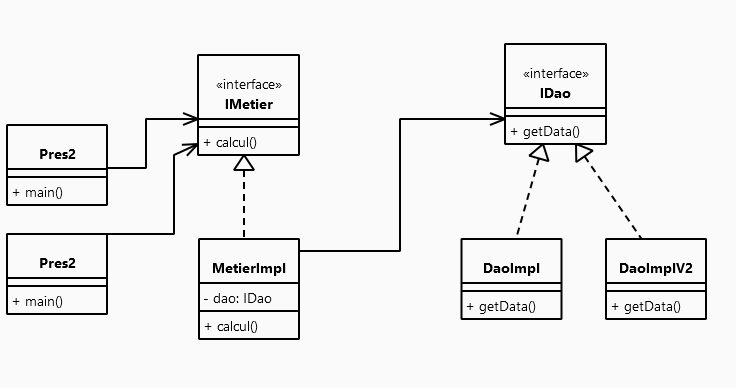
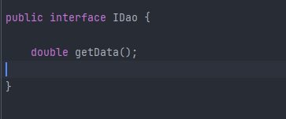
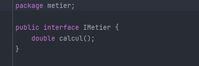
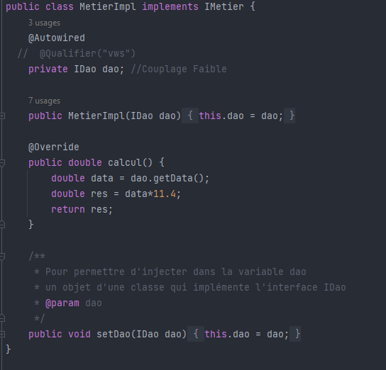

Realisée par : Ibrahim Tikarkaoussi

<h1 style="color: #ffffff"  >Rapport de l'inversion de contrôle et l'injection des dépendances</h1>
<h2 style="color: #b9e300">Introduction</h2>

L'inversion de contrôle est un principe du génie logiciel qui transfère le contrôle d'objets ou de parties d'un programme vers un conteneur ou un framework. On l'utilise le plus souvent dans le cadre de la programmation orientée objet.

<h2 style="color: #b9e300">Ennoncé :</h2>

<ol>
    <li>Couche DAO 
        <ul>
            <li>créer l'interface IDao</li>
            <li>créer une implémentation de l'interface IDao</li>
        </ul>
    </li>
    <li>Couche Métier
        <ul>
            <li>créer l'interface IMetier</li>
            <li>créer une implémentation de l'interface IMetier</li>
        </ul>
    </li>
    <li>Couche Présentation
        
Créer une application qui permet de faire l'injection des dépandences

        <ul>
        <li>Instantiation statique</li>
        <li>Instantiation dynamique</li>
        <li>En utilisant Spring Framework
            <ul>
                <li>version XML</li>
                <li>version Annotation</li>
            </ul>
        </li>
        </ul>
    </li>
</ol>
<h2 style="color: #b9e300">Conception</h2>
<h3>Principe du couplage faible</h3>

Le concept de couplage faible est essentiel lorsque nous concevons des systèmes logiciels. Il repose sur l'utilisation d'interfaces pour réduire la dépendance entre les composants. Pour illustrer cela, prenons deux classes, DaoImpl qui implémente l'interface IDao, et MetierImpl qui implémente l'interface IMetier.

Lorsque la classe MetierImpl est liée à l'interface IDao, nous pouvons dire qu'il existe un couplage faible entre la classe MetierImpl et la classe implémentant l'interface IDao. Cela signifie que la classe MetierImpl peut collaborer avec n'importe quelle classe qui respecte le contrat défini par l'interface IDao. En d'autres termes, la classe MetierImpl n'a besoin de connaître que l'existence de cette interface, ce qui lui permet de s'associer à n'importe quelle classe qui implémente cette interface sans nécessiter de modifications dans la classe MetierImpl.

Le couplage faible a pour avantage de rendre les applications résistantes aux modifications internes, car une modification dans une classe implémentant l'interface IDao n'affectera pas la classe MetierImpl, tant que le contrat de l'interface est respecté. De plus, cette approche offre une grande flexibilité pour les extensions, car de nouvelles classes implémentant l'interface peuvent être ajoutées sans perturber le fonctionnement de la classe MetierImpl. En résumé, le couplage faible favorise la modularité, la maintenance et l'évolutivité du code.

<h2 style="color: #b9e300">Captures d'écrans</h2>
<h3>Création de l'interface IDao</h3>

<h3>Création d'une implémentation de l'interface IDao version Base de Données</h3>

<h3>Création d'une implémentation de l'interface IDao version web services</h3>

<h3>Création de l'interface IMetier</h3>

<h3>Création d'une implémentation de l'interface IMetier</h3>

<h3>Instantiation statique</h3>

<h3>Instantiation dynamique</h3>

<h3>Injection des dépendances en utilisant Spring version xml</h3>

On doit installer en premier lieu les dépandences, ensuite ajouter un fichier config.xml

<h3>Injection des dépendances en utilisant Spring version annotations</h3>

Repository Class

Service Class

Controller

